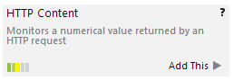

# Raspberry Pi Temperature & Humidity Sensor Project

The purpose of this project was to investigate building our own temperature and
humidty sensors for the datacenters. The units we were previously using were
over $400 and we found we could build our own for less than $100 each.

The files in this project are the configs that have been changed to get this
set up on top of raspbian and get the data in a format usable by PRTG. Since
this data is simply text on a web page, it should be easy to add it to other
monitoring systems as well.

## Installation


### 1. OS Installation

Installing the raspbian OS is pretty straightforward. Download the current
image of the full OS from: https://www.raspberrypi.org/downloads/

Follow the instructions found here: https://www.raspberrypi.org/documentation/installation/installing-images/README.md


### 2. Install the Apache web server

Install the apache web server:
```
sudo apt-get install apache2 apache2-utils
```
The standard install should work fine for this project. If you want to add SSL
support, you should get this set up now.


### 3. Python Environment

Note: These instructions are based on:
https://www.modmypi.com/blog/am2302-temphumidity-sensor

The first step is to get the build environment set up:
```
sudo apt-get install build-essential python-dev
```
Next clone the python modules from the AdaFruit git repo and build the module:
```
git clone https://github.com/adafruit/Adafruit_Python_DHT.git
cd Adafruit_Python_DHT
sudo python setup.py install
```

### 4. Hook up the sensor

The sensor should be hooked up as follows:


### 5. Set up the scripts in /usr/local/bin

The scripts in the usr-local-bin folder in this repo should be copied into
/usr/local/bin and given reasonable permissions. There's no real danger in
making them chmod 755 and owned by root.

### 6. Test the sensor

You can test the sensor:
```
sudo /usr/local/bin/unitemphum.py 2302 4
```
You should see output like this:
```
[69.3][34.4]
```


### 7. Set up a cron job to update the files in the document root

This should probably be run out of root's crontab:
```
sudo crontab -e
```
and add:
```
* * * * * /usr/local/bin/updatetemphum
```

With that cron job in place, the following files should be updated each minute:
* /var/www/html/temperature (the temperature in F)
* /var/www/html/humidity (the percent humidity)
* /var/www/html/temphum (both data points)

These are accessed via:
http://yourserver.uni.edu/temperature
http://yourserver.uni.edu/humidity
http://yourserver.uni.edu/temphum


### 8. Set up sensors in PRTG to graph the output

Now that we have files that are automatically populated with the temperature and
humidity data from our sensor, we can graph this in PRTG. This is done by
setting up an [HTTP Content sensor](https://www.paessler.com/manuals/prtg/http_content_sensor).



In this example we will set up a temperature sensor. This procedure can be
followed for the humidity sensor as well.

Configure the sensor with a reasonable name. In this case "Temperature". Then
give it the url from the previous step. Our values are floating point numbers
so change that from the default of integer. Finally make sure the number of
channels is 1. This is the number of data points in the source url that is
encapsulated in square brackets as you saw when testing in the previous step.

The sensore should look something like this:


To make the graph better we need to edit it again after it's initially
configured. Do this and go into the Channel Settings. Select the Value channel
and give it a better name, and a unit for the values:


You should now have a sensor set up that will graph the temperature from the
sensor. You can also now set up any alerts that are appropriate.


